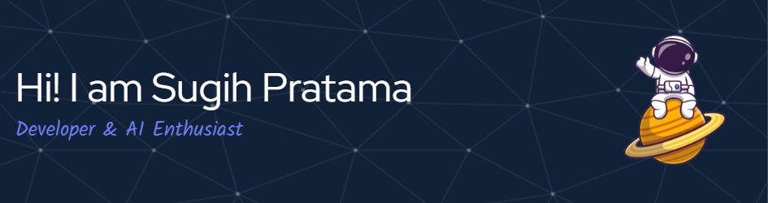

I'm a developer who enjoys building clean, useful, and sometimes weird things with code.  
By day, I craft web & mobile apps — mostly with React Native, Next.js, and Node.js.  
By night (and weekend), I explore the cloud ☁️ and get lost in AI & machine learning stuff 🤖

Currently learning Golang and DevOps, while keeping my heart close to AI-powered ideas 💡  
I believe great tech is built by curious minds — and I'm always curious.

Let’s build something cool together 🚀

#### 💻 Languages & Frameworks

#### 🧠 AI / Machine Learning

#### 📊 Data Science & Analysis

#### ☁️ Cloud & DevOps

### 📫 Reach me on

